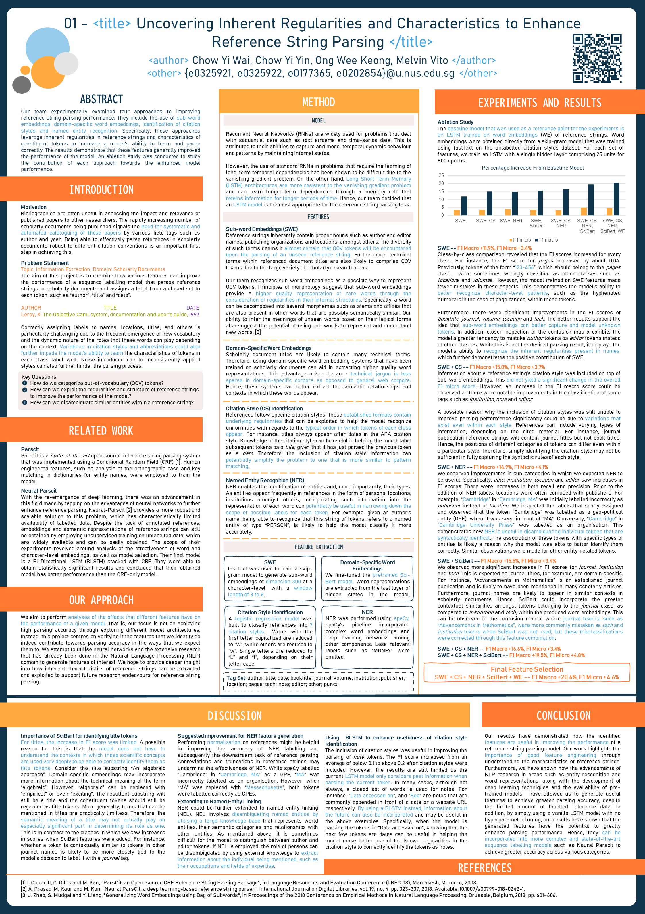

# ReferenceStringParser

Bibliographies are often useful in assessing the impact and relevance of published papers to other researchers. The rapidly increasing number of scholarly documents being published signals the need for systematic and automated cataloguing of these papers by various field tags such as author and year. Being able to effectively parse references in scholarly documents robust to different citation conventions is an important first step in achieving this. 

The code in this repository is designed to experiment with various features for a reference string parsing model, which parses reference strings in scholarly documents and assigns a label from a closed set to each token, such as author, title and date. The results can be used for further analysis on how the identified features can improve the performance of the model. Correctly assigning labels to names, locations, titles, and others is particularly challenging due to the frequent emergence of new vocabulary and the dynamic nature of the roles that these words can play depending on the context. Variations in citation styles and abbreviations could also further impede the model’s ability to learn the characteristics of tokens in each class label well. Noise introduced due to inconsistently applied styles can also further hinder the parsing process.

## Features
The features that were experimented include:
* Word Embeddings
* Sub-word Embeddings
* Domain-Specific Word Embeddings
* Named Entity Recognition (NER)
* Citation Style Identification

An ablation study was conducted using a vanilla LSTM model to assess the effectiveness of each feature on the overall parsing performance. In the final feature selection, all of the above features were combined and we obtained a micro F1 score of 0.92459 and macro F1 score of 0.76506. This is a significant improvement over our baseline model, which utilized word embeddings only. The baseline model only obtained a micro F1 score of 0.88379 and macro F1 score of 0.63426.

## Overall Findings
Our experimentations have demonstrated that the identified features are useful in improving the performance of a reference string parsing model. Our work highlights the importance of good feature engineering through understanding the characteristics of reference strings. Furthermore, we have shown how the advancements of NLP research in areas such as entity recognition and word representations, along with the development of deep learning techniques and the availability of pre-trained models,  has allowed us to generate useful features to achieve greater parsing accuracy, despite the limited amount of labelled reference data. 

In addition, by simply using a vanilla LSTM model with no hyperparameter tuning, our results have shown that the generated features have the potential to greatly enhance parsing performance. For more information, refer to our poster below:

## Useful Files
### `main.ipynb`
This is the Jupyter notebook that was used to conduct experimentations using the various features. You can run the relevant cells to test the model on features of interest.

### `LR_citation_recognition.ipynb`
We built a logistic regression model to identify the citation style of a reference string and achieved a F1 score of 0.99968 on our test set. This model is saved in the `models` directory and can be used independently of the reference string parsing model for other projects as well.

### Fine-tuned SciBert model
We fine-tuned a pretrained SciBert model on our reference string dataset to obtain domain specific word embedding. The configuration file for this model can be found under the `models/bert/fine_tuned_bert` directory. This was obtained by running a `run_mlm.py` script provided by [huggingface](https://github.com/huggingface/transformers/tree/master/examples/language-modeling). 

### Dataset
The adopted datasets include the [Cora information extraction dataset](https://people.cs.umass.edu/~mccallum/data.html) and [UMass Citation Field Extraction dataset](https://sites.google.com/a/iesl.cs.umass.edu/home/data/umasscitationfield). They contain approximately 500 and 1500 manually labelled references from English Computer Science articles and various scientific fields, respectively. As the formats of the datasets differed slightly, data normalization was performed to standardize tag names. This standardized dataset can also be found in the same directory. The script `dataset_standardizer.py` in the root directory can be used to standardize the tag names. You can edit the file and customize the tag mappings between the datasets if you wish.

The jstor subdirectory contains collections of metadata from books and journal articles that were obtained from JSTOR using their Data For Research tool. The dataset contains XML files that include many details including the field tags, and others such as the Digital Object Identifier (DOI). The DOI of the books and articles were extracted and used to send Content Negotiation requests to a DOI Resolver (CrossRef’s API). 

Reference strings formatted in 7 citation styles (ACM-Sig-Proceedings, American-Chemical-Society, APA, chicago-author-date, Harvard3, IEEE and MLA) can be found under the `cstyle_dataset` subdirectory.

## References
* A New Dataset for Fine-Grained Citation Field Extraction. Sam Anzaroot, Andrew McCallum. ICML Workshop on Peer Reviewing and Publishing Models (PEER), 2013.
